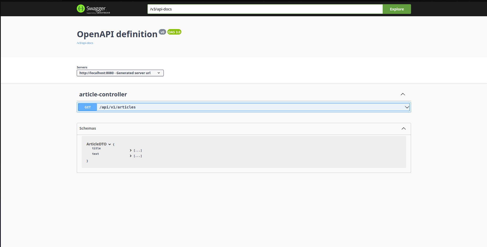
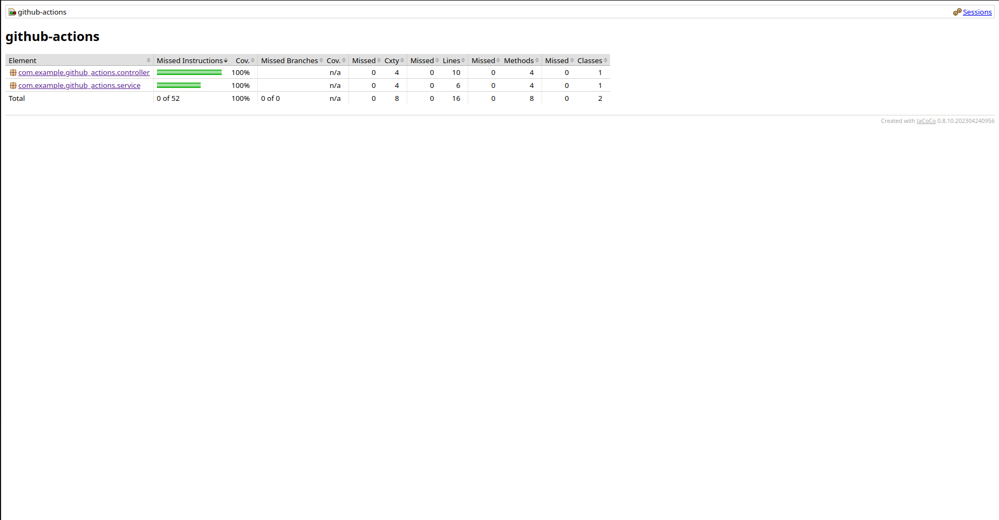
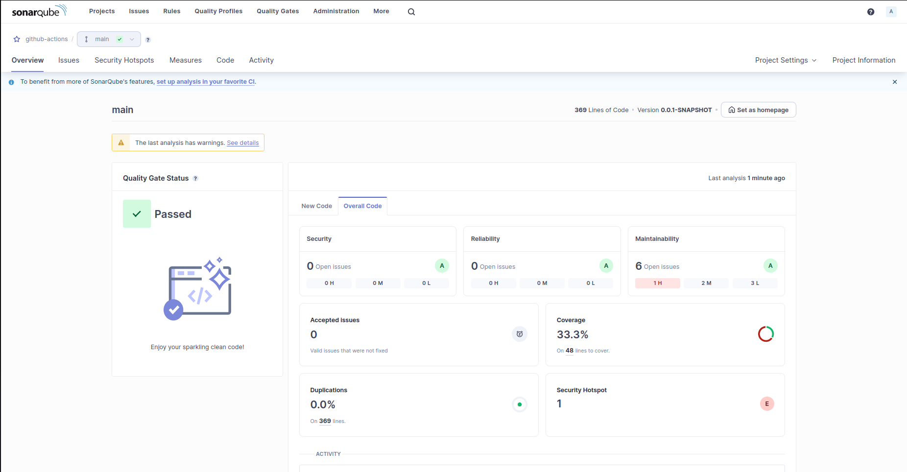

# Простое Spring приложение с использованием CI/CD, проверки покрытия кода тестами и мониторинга

Проект для закрепления материала по CI/CD, полностью покрытый тестами с мониторингом.

## Требования

* Open JDK 17
* Apache Maven 3.8

## Запуск 

Перед запуском необходимо **настроить переменные окружения** в .env.

### Docker Compose

Сначала скомпилируем наше приложение в .jar для построение образа нашего приложения:

```bash
mvn clean package
```

Для запуска приложения с помощью Docker:

```bash
docker compose up -d
```

## Routes



## Тестирование

Все тесты находятся в src/test. Тестирование с помощью JUnit и Mockito. Тестируются только **service** и **controller** пакеты.

Для **запуска** тестов:

```bash
mvn clean test
```

Для отображения покрытия тестов с помощью JaCoCo:

```bash
mvn clean verify jacoco:report
open target/site/index.html
```



Для более красивого и подробного покрытия кода используется SonarQube:

```bash
mvn sonar:sonar
```

SonarQube находится на localhost:9000. Необходимо авторизоваться в сервисе:

**login**=admin

**password**=admin

После этого вас попросят поменять пароль.



## Мониторинг
